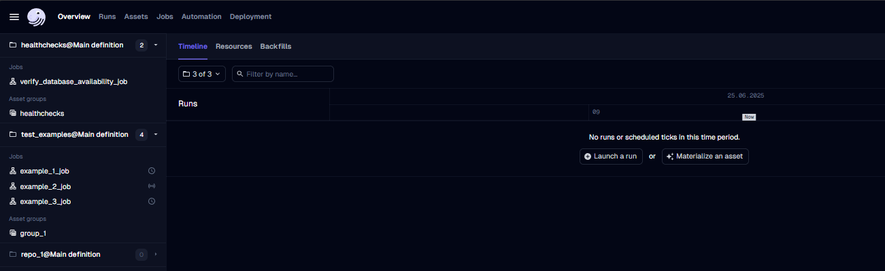
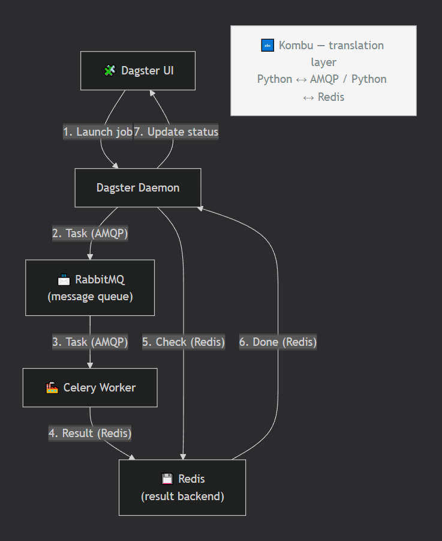

 🧩➡️🏭➡️🚛 ETL Pipeline with Dagster & dbt
 
## 📖 Description
 
This project is an ETL pipeline. Dagster handles orchestration — it starts, schedules, and watches the jobs. dbt handles the data transformation — it turns raw data into clean, usable tables.
 
The project includes:
- **Dagster** orchestrates the pipeline. It starts jobs, runs them on a schedule, and watches that everything finishes correctly.
- **dbt** transforms the raw data. It turns it into clean, ready-to-use tables.
- **PostgreSQL** stores the processed data for analytics (an external service).
 
## 🛠️ Technologies
 
- **Dagster webserver** – the main UI, where you see and run jobs.
- **Dagster daemon** – runs schedules and picks up queued runs in the background.
- **Dagster user code server** – loads your custom Dagster code (jobs, assets, resources) and serves it over gRPC.
- **PostgreSQL (Dagster)** – stores Dagster's run history, schedules, and event logs.
- **Celery executor** – runs the actual steps of a job, through RabbitMQ and Redis.
- **dbt docs service** – prepares the dbt project files and serves the dbt documentation site.
- **PostgreSQL (Analytics)** – stores the final, transformed data (external service, started separately).
- **RabbitMQ** – message broker between Dagster and the Celery executor.
- **Redis** – stores the results of Celery tasks.
- **Flower** – web UI for watching Celery tasks.
- **Docker** – runs everything in containers
- **Python libraries** for data processing
## ⚙️ Installation
 
**Requirements:**
- Python 3.11+
- Docker
- Love of ETL ❤️
```bash
# Clone the repository
git clone https://github.com/VadimVG/dagster-dbt-docker.git
cd dagster-dbt-docker
 
# Create the external docker network (used by both this project and the analytics db)
docker network create data-platform-net
 
# Start the Dagster + dbt project (default .env works for testing)
cd ci/docker
docker-compose up -d
```
 
## 🧩 Components / Services
 
### 1. Dagster webserver
Main UI. Lets you see, trigger, and monitor job runs.
- **Port:** `3000` (Web UI)
- **Depends on:** PostgreSQL (Dagster), user code server
### 2. Dagster daemon
Runs in the background. Handles schedules and picks up queued runs.
- **Depends on:** PostgreSQL (Dagster), user code server
### 3. Dagster user code server
Loads your custom Dagster code (jobs, assets, resources) and serves it to the webserver and daemon.
### 4. PostgreSQL (Dagster)
Stores Dagster's run history, schedules, and event logs.
- **Image:** `postgres:17`
- **Port:** set by `PG_PORT` in your `.env`
- **Port:** `4000` (internal only, not exposed to your machine)
### 5. Celery executor
Runs the actual steps of a Dagster job. Picks up tasks from RabbitMQ and works through them.
- **Concurrency:** `10` workers
- **Depends on:** PostgreSQL (Dagster), RabbitMQ, Redis
### 6. dbt docs service
Prepares the dbt project (`dbt parse`, `dbt docs generate`) and serves the dbt documentation site.
- **Port:** `8001`
### 7. PostgreSQL (Analytics)
Stores the final, transformed data.
 
### 8. RabbitMQ
Message broker between Dagster and the Celery executor.
- **Image:** `rabbitmq:4.1.8-management`
- **Ports:** `5672` (AMQP), `15672` (management UI)
### 9. Redis
Stores task results for Celery.
- **Image:** `redis:8.0.6-alpine`
- **Port:** `6379`
### 10. Flower
Web UI for watching Celery tasks.
- **Image:** `mher/flower:2.0.1`
- **Port:** `5555`
## 🚀 Launch and testing
 
1. Open http://localhost:3000/overview/activity/timeline. You should see the Dagster start page.

 
2. Run the test jobs to check that everything works:
   - Open the sidebar.
   - `verify_database_availability_job` → click **Materialize**.
   - `example_1_job` → click **Materialize all**.
   - `example_2_job` → click **Launchpad** → click **Launch run**.
   - `example_3_job` → click **Launchpad** → click **Launch run**.
3. If all jobs finish without errors, the project is ready to use.

**Enjoy the beautiful Dagster and dbt 🎉✨**
 
## 🔄 How it works
 
The flow in simple words:
1. You trigger a job in the Dagster webserver, or a schedule starts it.
2. The daemon picks up the run and sends each step to Celery through RabbitMQ.
3. A Celery worker (the executor) picks up the step and runs it — usually a dbt command.
4. dbt transforms the raw data in the Analytics PostgreSQL database.
5. Redis stores the result and status of each step. You can watch progress in the Dagster UI and in Flower.
### Celery executor in detail
 

 
## ℹ️ Useful info
 
- Dagster UI – port `3000` – http://localhost:3000
- dbt docs – port `8001` – http://localhost:8001
- Flower – port `5555` – http://localhost:5555
- RabbitMQ UI – port `15672` – http://localhost:15672
- RabbitMQ (AMQP) – port `5672`
- Redis – port `6379`
- PostgreSQL (Dagster) – port set by `PG_PORT` in `.env`
