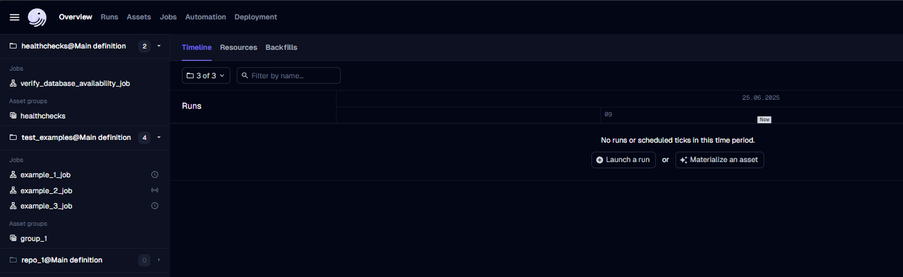

# Modern Data Platform on Dagster & dbt
 
## 📖 Description
 
This project is a data platform. Dagster handles orchestration — it starts, schedules, and watches the jobs. dbt handles the data transformation — it turns raw data into clean, usable tables.
 
The project includes:

- **Dagster** orchestrates the pipeline. It starts jobs, runs them on a schedule, and watches that everything finishes correctly.
- **dbt** transforms the raw data. It turns it into clean, ready-to-use tables.
- **Job steps** run in two ways: on **Celery** workers (RabbitMQ broker, Redis result backend) in Docker Compose, or in a separate **Kubernetes pod for each run** (K8sRunLauncher) in Kubernetes.
- **PostgreSQL** stores the processed data for analytics (an external service).
- **Vault** stores secrets in the Kubernetes setup. Docker Compose reads them from the `.env` file.
- **Python libraries** for data processing.

## ⚙️ Installation
 
**Requirements:**

- Love of data engineering ❤️
- Docker and Docker Compose
- For Kubernetes: kind, kubectl, helm (see the K8s guide)

**Get the code:**

```bash
git clone https://github.com/VadimVG/dagster-dbt-docker.git
cd dagster-dbt-docker
```

The data warehouse (DWH) is not part of this project. It runs as a separate Docker Compose project, which creates the Docker network `data-platform-net`. If you run without that project, create the network by hand once:

```bash
docker network create data-platform-net
```

The Kubernetes setup also needs the network `secrets-net` from the Vault project.

**Choose how to run it:**

- [Docker Compose](./ci/docker/README.md)
- [Kubernetes (kind)](./ci/k8s/README.md)
 

## 🚀 Launch and testing
 
1. Open http://localhost:3000/overview/activity/timeline. You should see the Dagster start page. In Kubernetes, start the port-forward first (see the K8s guide, Step 8).

   
 
2. Run the test jobs to check that everything works. Open the sidebar, select a job, and:
   - `verify_database_availability_job` → click **Materialize all**. Run it first: it creates the schemas in the DWH.
   - `asset_example_job` → click **Materialize all**.
   - `op_example_job` → click **Launchpad** → click **Launch run**.
   - `dynamic_output_op_example_job` → click **Launchpad** → click **Launch run**.
3. If all jobs finish without errors, the project is ready to use.

**Enjoy the beautiful Dagster and dbt 🎉✨**

